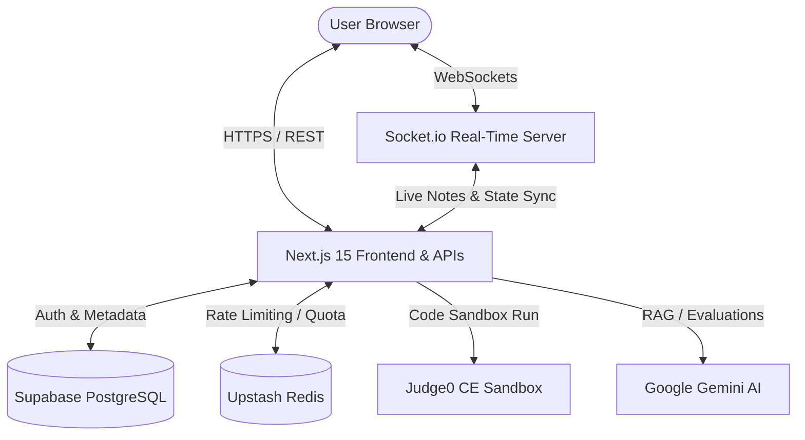

# ✦ Iteratr — AI-Powered Technical Interview & Mentorship Platform ✦

[](#)
[](#)
[](#)
[](#)
[](#)

Iteratr is an enterprise-grade AI technical interviewing and coding mentorship platform. It provides candidates with adaptive coding practice, Socratic hint guidance, sandboxed execution, and comprehensive interview-grade feedback scorecards.

---

## 🚀 Key Features

* **Adaptive Elo Engine:** Tracks user performance metrics to adjust question difficulty dynamically using a progressive ranking system.
* **Socratic Hinting System:** A multi-tiered AI hinting pipeline that guides developers toward the solution without revealing code directly, reinforcing conceptual understanding.
* **Sandboxed Code Execution:** Secure multi-language compilation powered by the Judge0 sandbox, combined with automated AI runtime verification.
* **RAG-Powered Question Banks:** Semantic document indexing via `text-embedding-004` and Supabase `pgvector` to automatically construct custom knowledge-based interview contexts.
* **Real-Time WebSocket Assessments:** Low-latency chat synchronization using Socket.io to record candidate inputs, live interviewer instructions, and silent grader evaluation logs.
* **Developer Dashboard & Replays:** Interactive performance graphs utilizing Recharts, coupled with dialogue timelines and complete transcript replays.
* **High-Availability Key Rotation:** Automated token-bucket key-rotation architecture across multiple Gemini API keys to bypass API quotas and ensure 99.9% platform availability.

---

## 🏛️ System Architecture

Iteratr is designed with a decoupled architecture to separate application delivery from real-time streaming services:



1. **Next.js App Server (`/src`):** Core application frontend, secure API routes, user data persistence via Supabase, and AI workflows using Google Gemini.
2. **WebSocket Signaling Server (`/server`):** Low-latency Node.js Socket.io server to maintain persistent bi-directional streams, syncing coder state and live grader notes.

---

## 💻 Tech Stack

* **Core Framework:** Next.js 15 (App Router), React 19, TypeScript
* **State & Editor:** Monaco Editor
* **Database & Vector Search:** Supabase, PostgreSQL, `pgvector`
* **Real-time Synchronization:** Socket.io, WebSockets
* **Caching & Rate-Limiting:** Upstash Redis (Rest Client)
* **Code Compilation:** Judge0 CE Sandbox
* **Visualizations:** Recharts, Tailwind CSS 4, Lucide Icons
* **Security & Auth:** NextAuth.js, JWT, OAuth 2.0 (Google & GitHub)

---

## 🛠️ Setup & Installation

### Prerequisites
* **Node.js** 20.x or higher
* **npm** 9.x or higher
* **Supabase** project instance
* **Gemini API Key** (Google AI Studio)
* **Upstash Redis** database instance (Optional but recommended)

### 1. Clone & Install Dependencies
```bash
# Clone the repository
git clone https://github.com/Premshaw23/iteratr.git
cd iteratr

# Install frontend dependencies
npm install
```

### 2. Configure Environment Variables
Copy `.env.example` to `.env.local` and fill in the necessary secrets:
```bash
cp .env.example .env.local
```

| Environment Variable | Description |
| :--- | :--- |
| `NEXTAUTH_SECRET` | NextAuth encryption secret (`openssl rand -base64 32`) |
| `NEXT_PUBLIC_SUPABASE_URL` | Your Supabase project URL |
| `SUPABASE_SERVICE_ROLE_KEY` | Supabase high-privilege service key |
| `GEMINI_API_KEY` | Google Gemini API key (comma-separated list for rotation) |
| `UPSTASH_REDIS_REST_URL` | Upstash Redis connection REST URL |
| `UPSTASH_REDIS_REST_TOKEN` | Upstash Redis connection token |
| `JUDGE0_API_URL` | Judge0 CE compilation sandbox endpoint |
| `NEXT_PUBLIC_WS_URL` | WebSocket URL for active interviewer session |

### 3. Launch Development Environment

Run the Next.js frontend application:
```bash
npm run dev
```

In a new terminal window, initialize and start the WebSocket server:
```bash
cd server
npm install
node index.js
```

---

## 🧪 Quality Standards & Validation

Before pushing commits, run type checks and linter tools to ensure formatting integrity:

```bash
# Compile and check TypeScript types
npx tsc --noEmit

# Run project linter
npm run lint
```

---

## 📄 License

This project is licensed under the **MIT License** - see the [LICENSE](file:///e:/Web-Dev/Major Project/iteratr/LICENSE) file for details.
